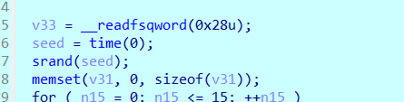
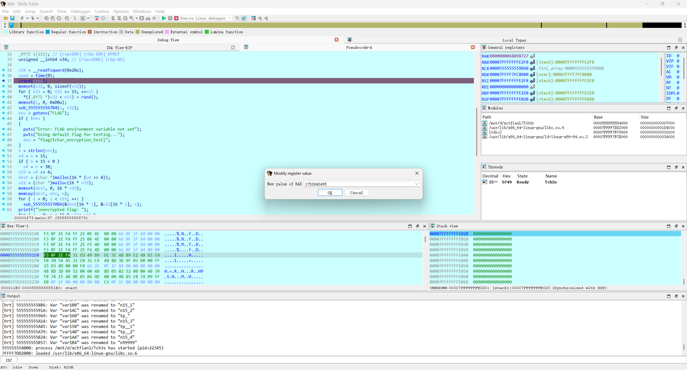
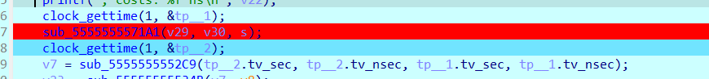
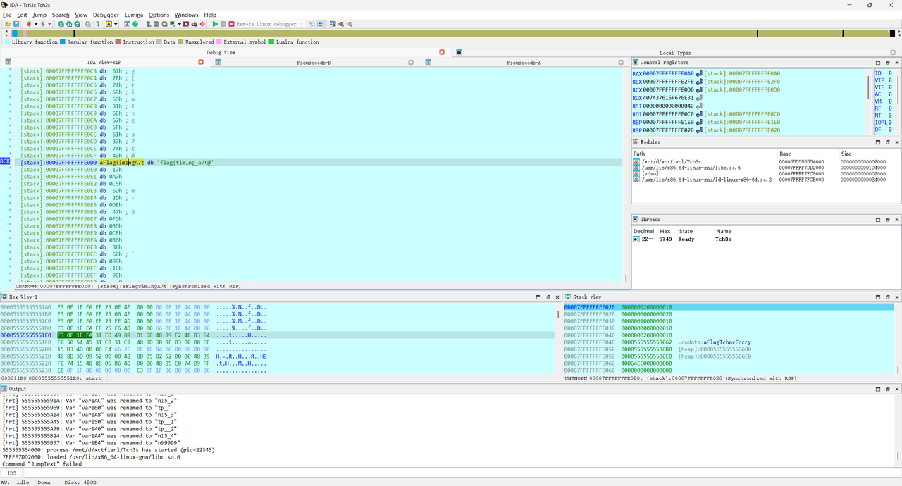
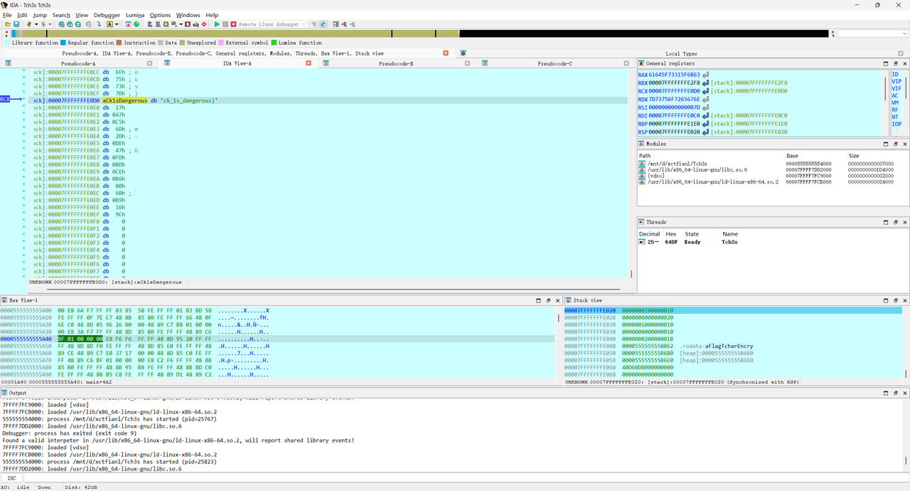
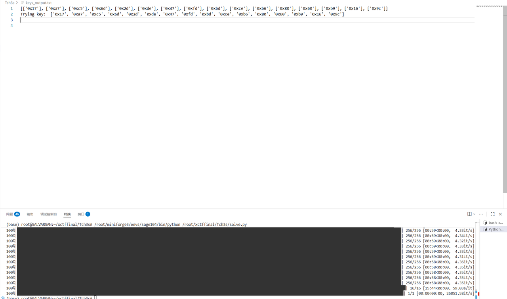
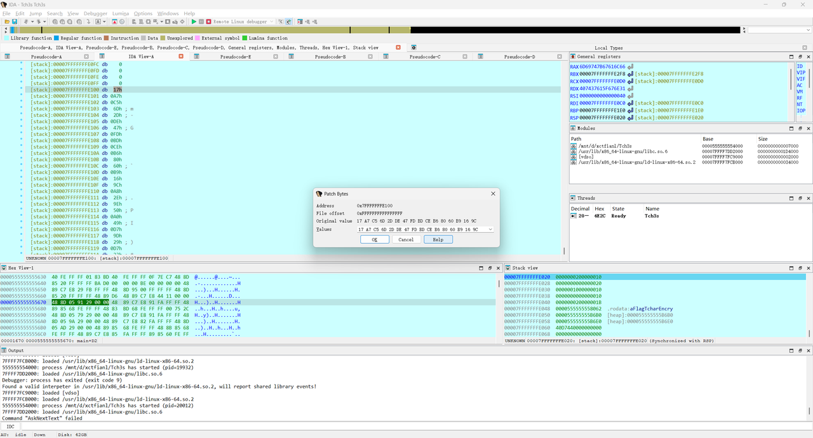

### 非预期

被xctf final push 后获得了ida初级使用技能，你也快来试一试吧~~

把代码拖进ida，main函数如下：

```
int64 __fastcall main(int a1, char **a2, char **a3)
{
  unsigned int v3; // eax
  int v4; // eax
  int v5; // eax
  int v6; // edx
  int v7; // eax
  int v8; // edx
  int i; // [rsp+0h] [rbp-1C0h]
  int j; // [rsp+4h] [rbp-1BCh]
  int k; // [rsp+8h] [rbp-1B8h]
  int m; // [rsp+Ch] [rbp-1B4h]
  int n; // [rsp+10h] [rbp-1B0h]
  int ii; // [rsp+14h] [rbp-1ACh]
  int jj; // [rsp+18h] [rbp-1A8h]
  int kk; // [rsp+1Ch] [rbp-1A4h]
  int v18; // [rsp+20h] [rbp-1A0h]
  int num_2; // [rsp+24h] [rbp-19Ch]
  const char *s; // [rsp+28h] [rbp-198h]
  void *input; // [rsp+30h] [rbp-190h]
  __int64 *encrypted_flag; // [rsp+38h] [rbp-188h]
  double v23; // [rsp+40h] [rbp-180h]
  double v24; // [rsp+48h] [rbp-178h]
  struct timespec tp; // [rsp+50h] [rbp-170h] BYREF
  struct timespec v26; // [rsp+60h] [rbp-160h] BYREF
  struct timespec v27; // [rsp+70h] [rbp-150h] BYREF
  struct timespec v28; // [rsp+80h] [rbp-140h] BYREF
  char rand_num[16]; // [rsp+90h] [rbp-130h] BYREF
  __int64 v30[2]; // [rsp+A0h] [rbp-120h] BYREF
  __int64 v31[2]; // [rsp+B0h] [rbp-110h] BYREF
  __int64 v32[4]; // [rsp+C0h] [rbp-100h] BYREF
  char key[216]; // [rsp+E0h] [rbp-E0h] BYREF
  unsigned __int64 v34; // [rsp+1B8h] [rbp-8h]

  v34 = __readfsqword(0x28u);
  v3 = time(0LL);
  srand(v3);
  memset(v32, 0, sizeof(v32));
  for ( i = 0; i <= 15; ++i )
    *((_BYTE *)v32 + i) = rand();
  memset(key, 0, 0xD0uLL);
  key_init((__int64)key, v32);
  s = getenv("FLAG");
  if ( !s )
  {
    puts("Error: FLAG environment variable not set");
    puts("Using default flag for testing...");
    s = "flag{tchar_encryption_test}";
  }
  v18 = strlen(s);
  v4 = v18 + 15;
  if ( v18 + 15 < 0 )
    v4 = v18 + 30;
  num_2 = v4 >> 4;
  input = malloc(16 * (v4 >> 4));
  encrypted_flag = (__int64 *)malloc(16 * num_2);
  memset(input, 0, 16 * num_2);
  memcpy(input, s, v18);
  for ( j = 0; j < num_2; ++j )                 // num_2的值是2
    enc((__int64 *)input + 2 * j, &encrypted_flag[2 * j], (__int64)key);
  printf("\nencrypted flag: ");
  for ( k = 0; k < 16 * num_2; ++k )
    printf("%02X", *((unsigned __int8 *)encrypted_flag + k));
  puts("\n");
  v30[0] = 0LL;
  v30[1] = 0LL;
  v31[0] = 0LL;
  v31[1] = 0LL;
  for ( m = 0; m <= 99999; ++m )
  {
    for ( n = 0; n <= 15; ++n )
      rand_num[n] = rand();
    printf("Test %d plaintext: ", (unsigned int)(m + 1));
    for ( ii = 0; ii <= 15; ++ii )
      printf("%02X", (unsigned __int8)rand_num[ii]);
    putchar(10);
    clock_gettime(1, &tp);
    enc((__int64 *)rand_num, v30, (__int64)key);
    clock_gettime(1, &v26);
    v5 = sub_5FDE2EF222C9(v26.tv_sec, v26.tv_nsec, tp.tv_sec, tp.tv_nsec);
    v23 = sub_5FDE2EF2234B(v5, v6);
    printf("Test %d encrypted: ", (unsigned int)(m + 1));
    for ( jj = 0; jj <= 15; ++jj )
      printf("%02X", *((unsigned __int8 *)v30 + jj));
    printf(", costs: %f ns\n", v23);
    clock_gettime(1, &v27);
    decryp((__int64)v30, v31, (__int64)key);
    clock_gettime(1, &v28);
    v7 = sub_5FDE2EF222C9(v28.tv_sec, v28.tv_nsec, v27.tv_sec, v27.tv_nsec);
    v24 = sub_5FDE2EF2234B(v7, v8);
    printf("Test %d decrypted: ", (unsigned int)(m + 1));
    for ( kk = 0; kk <= 15; ++kk )
      printf("%02X", *((unsigned __int8 *)v31 + kk));
    printf(", costs: %f ns\n\n", v24);
  }
  return 0LL;
```

分析得到整个代码流程：`srand(time(NULL))`，然后用 `rand()` 每次生成16字节，并且取低字节，生成16次后取16字节的key，用 key 对 flag 进行某种分组加密，然后打印出来进行多次循环，每次循环重新随机 16 字节的 plaintext，进行加密和解密，然后打印经过的时间

可以看到srand的seed在整个代码流程里是没有更新的，存在预测的可能性。

通过爆破可以得到seed的值，由于明文也是rand后得到的，所以我们可以通过判断seed经过16轮后生成的plaintext1来作为判断条件(注意前面还有16轮的key生成)，代码如下：

```
#include <stdbool.h>
#include <stdint.h>
#include <stdio.h>
#include <stdlib.h>
#include <time.h>

// 720B4455C91B6A024135343386B6679D
// hex_str = "720B4455C91B6A024135343386B6679D"
// byte_list = ["0x"+(hex_str[i:i+2]) for i in range(0, len(hex_str), 2)]
// print(byte_list)

uint8_t first_pt[] = {0x72, 0x0B, 0x44, 0x55, 0xC9, 0x1B, 0x6A, 0x02, 0x41, 0x35, 0x34, 0x33, 0x86, 0xB6, 0x67, 0x9D};

int main() {
    uint32_t seed0 = time(0LL);
    for (int seed = seed0 - 365*24*60*60; seed < seed0 ; seed++) {
        srand(seed);
        bool ok = true;
        for (int i = 0; i < 16; i++) rand();

        for (int i = 0; i < 16; i++) {
            uint8_t val = rand() & 0xFF;
            if (val != first_pt[i]) {
                ok = false;
                break;
            }
        }
        if (ok)
        {
            printf("%d\n", seed);
            srand(seed);
            for (int i = 0; i < 16; i++) {
                uint8_t val = rand() & 0xFF;
                printf("0x%02X,", val);
            }
            printf("\n");
            break;
        }

    }
    return 0;
}
```

得到seed= 1753843495，进入ida动调，

把seed换成上面爆破出来的





在解密函数中把密文分两次换成encrypted_flag，替换v29，f8运行：



查看v31，按一下a，得到一半flag：



得到另一半flag：


> flag{tim1ng_a7t@ck_1s_dangerous}
> 

### 预期解

参考妙妙小博客：

https://d33b4t0.com/Recording%20of%20Timing%20Attack%20in%20CTF/#UofTCTF-2025-Timed-AES-Crypto-4-solveshttps://d33b4t0.com/Recording%20of%20Timing%20Attack%20in%20CTF/#UofTCTF-2025-Timed-AES-Crypto-4-solves

我这里用的是加密时间得到了K0，最开始用的是K10，但是写密钥恢复函数有点困难，看不太懂他们的逻辑，也写不太出来，这里选择K0，直接放进ida里动态调试，把encrypted_flag替换原本的解密函数的密文，可以直接得出flag。脚本基本就是替换一下s盒，改一下字节替换的逻辑，代码如下：

```
import os
from tqdm import tqdm
from scipy.stats import pearsonr
import itertools
from math import prod

inv_aes=[0x52, 0x09, 0x6A, 0xD5, 0x30, 0x36, 0xA5, 0x38, 0xBF, 0x40, 0xA3, 0x9E, 0x81, 0xF3, 0xD7, 0xFB, 0x7C, 0xE3, 0x39, 0x82, 0x9B, 0x2F, 0xFF, 0x87, 0x34, 0x8E, 0x43, 0x44, 0xC4, 0xDE, 0xE9, 0xCB, 0x54, 0x7B, 0x94, 0x32, 0xA6, 0xC2, 0x23, 0x3D, 0xEE, 0x4C, 0x95, 0x0B, 0x42, 0xFA, 0xC3, 0x4E, 0x08, 0x2E, 0xA1, 0x66, 0x28, 0xD9, 0x24, 0xB2, 0x76, 0x5B, 0xA2, 0x49, 0x6D, 0x8B, 0xD1, 0x25, 0x72, 0xF8, 0xF6, 0x64, 0x86, 0x68, 0x98, 0x16, 0xD4, 0xA4, 0x5C, 0xCC, 0x5D, 0x65, 0xB6, 0x92, 0x6C, 0x70, 0x48, 0x50, 0xFD, 0xED, 0xB9, 0xDA, 0x5E, 0x15, 0x46, 0x57, 0xA7, 0x8D, 0x9D, 0x84, 0x90, 0xD8, 0xAB, 0x00, 0x8C, 0xBC, 0xD3, 0x0A, 0xF7, 0xE4, 0x58, 0x05, 0xB8, 0xB3, 0x45, 0x06, 0xD0, 0x2C, 0x1E, 0x8F, 0xCA, 0x3F, 0x0F, 0x02, 0xC1, 0xAF, 0xBD, 0x03, 0x01, 0x13, 0x8A, 0x6B, 0x3A, 0x91, 0x11, 0x41, 0x4F, 0x67, 0xDC, 0xEA, 0x97, 0xF2, 0xCF, 0xCE, 0xF0, 0xB4, 0xE6, 0x73, 0x96, 0xAC, 0x74, 0x22, 0xE7, 0xAD, 0x35, 0x85, 0xE2, 0xF9, 0x37, 0xE8, 0x1C, 0x75, 0xDF, 0x6E, 0x47, 0xF1, 0x1A, 0x71, 0x1D, 0x29, 0xC5, 0x89, 0x6F, 0xB7, 0x62, 0x0E, 0xAA, 0x18, 0xBE, 0x1B, 0xFC, 0x56, 0x3E, 0x4B, 0xC6, 0xD2, 0x79, 0x20, 0x9A, 0xDB, 0xC0, 0xFE, 0x78, 0xCD, 0x5A, 0xF4, 0x1F, 0xDD, 0xA8, 0x33, 0x88, 0x07, 0xC7, 0x31, 0xB1, 0x12, 0x10, 0x59, 0x27, 0x80, 0xEC, 0x5F, 0x60, 0x51, 0x7F, 0xA9, 0x19, 0xB5, 0x4A, 0x0D, 0x2D, 0xE5, 0x7A, 0x9F, 0x93, 0xC9, 0x9C, 0xEF, 0xA0, 0xE0, 0x3B, 0x4D, 0xAE, 0x2A, 0xF5, 0xB0, 0xC8, 0xEB, 0xBB, 0x3C, 0x83, 0x53, 0x99, 0x61, 0x17, 0x2B, 0x04, 0x7E, 0xBA, 0x77, 0xD6, 0x26, 0xE1, 0x69, 0x14, 0x63, 0x55, 0x21, 0x0C, 0x7D]
Camellia=[0x70, 0x82, 0x2C, 0xEC, 0xB3, 0x27, 0xC0, 0xE5, 0xE4, 0x85, 0x57, 0x35, 0xEA, 0x0C, 0xAE, 0x41, 0x23, 0xEF, 0x6B, 0x93, 0x45, 0x19, 0xA5, 0x21, 0xED, 0x0E, 0x4F, 0x4E, 0x1D, 0x65, 0x92, 0xBD, 0x86, 0xB8, 0xAF, 0x8F, 0x7C, 0xEB, 0x1F, 0xCE, 0x3E, 0x30, 0xDC, 0x5F, 0x5E, 0xC5, 0x0B, 0x1A, 0xA6, 0xE1, 0x39, 0xCA, 0xD5, 0x47, 0x5D, 0x3D, 0xD9, 0x01, 0x5A, 0xD6, 0x51, 0x56, 0x6C, 0x4D, 0x8B, 0x0D, 0x9A, 0x66, 0xFB, 0xCC, 0xB0, 0x2D, 0x74, 0x12, 0x2B, 0x20, 0xF0, 0xB1, 0x84, 0x99, 0xDF, 0x4C, 0xCB, 0xC2, 0x34, 0x7E, 0x76, 0x05, 0x6D, 0xB7, 0xA9, 0x31, 0xD1, 0x17, 0x04, 0xD7, 0x14, 0x58, 0x3A, 0x61, 0xDE, 0x1B, 0x11, 0x1C, 0x32, 0x0F, 0x9C, 0x16, 0x53, 0x18, 0xF2, 0x22, 0xFE, 0x44, 0xCF, 0xB2, 0xC3, 0xB5, 0x7A, 0x91, 0x24, 0x08, 0xE8, 0xA8, 0x60, 0xFC, 0x69, 0x50, 0xAA, 0xD0, 0xA0, 0x7D, 0xA1, 0x89, 0x62, 0x97, 0x54, 0x5B, 0x1E, 0x95, 0xE0, 0xFF, 0x64, 0xD2, 0x10, 0xC4, 0x00, 0x48, 0xA3, 0xF7, 0x75, 0xDB, 0x8A, 0x03, 0xE6, 0xDA, 0x09, 0x3F, 0xDD, 0x94, 0x87, 0x5C, 0x83, 0x02, 0xCD, 0x4A, 0x90, 0x33, 0x73, 0x67, 0xF6, 0xF3, 0x9D, 0x7F, 0xBF, 0xE2, 0x52, 0x9B, 0xD8, 0x26, 0xC8, 0x37, 0xC6, 0x3B, 0x81, 0x96, 0x6F, 0x4B, 0x13, 0xBE, 0x63, 0x2E, 0xE9, 0x79, 0xA7, 0x8C, 0x9F, 0x6E, 0xBC, 0x8E, 0x29, 0xF5, 0xF9, 0xB6, 0x2F, 0xFD, 0xB4, 0x59, 0x78, 0x98, 0x06, 0x6A, 0xE7, 0x46, 0x71, 0xBA, 0xD4, 0x25, 0xAB, 0x42, 0x88, 0xA2, 0x8D, 0xFA, 0x72, 0x07, 0xB9, 0x55, 0xF8, 0xEE, 0xAC, 0x0A, 0x36, 0x49, 0x2A, 0x68, 0x3C, 0x38, 0xF1, 0xA4, 0x40, 0x28, 0xD3, 0x7B, 0xBB, 0xC9, 0x43, 0xC1, 0x15, 0xE3, 0xAD, 0xF4, 0x77, 0xC7, 0x80, 0x9E]
aes=[0x63, 0x7C, 0x77, 0x7B, 0xF2, 0x6B, 0x6F, 0xC5, 0x30, 0x01, 0x67, 0x2B, 0xFE, 0xD7, 0xAB, 0x76, 0xCA, 0x82, 0xC9, 0x7D, 0xFA, 0x59, 0x47, 0xF0, 0xAD, 0xD4, 0xA2, 0xAF, 0x9C, 0xA4, 0x72, 0xC0, 0xB7, 0xFD, 0x93, 0x26, 0x36, 0x3F, 0xF7, 0xCC, 0x34, 0xA5, 0xE5, 0xF1, 0x71, 0xD8, 0x31, 0x15, 0x04, 0xC7, 0x23, 0xC3, 0x18, 0x96, 0x05, 0x9A, 0x07, 0x12, 0x80, 0xE2, 0xEB, 0x27, 0xB2, 0x75, 0x09, 0x83, 0x2C, 0x1A, 0x1B, 0x6E, 0x5A, 0xA0, 0x52, 0x3B, 0xD6, 0xB3, 0x29, 0xE3, 0x2F, 0x84, 0x53, 0xD1, 0x00, 0xED, 0x20, 0xFC, 0xB1, 0x5B, 0x6A, 0xCB, 0xBE, 0x39, 0x4A, 0x4C, 0x58, 0xCF, 0xD0, 0xEF, 0xAA, 0xFB, 0x43, 0x4D, 0x33, 0x85, 0x45, 0xF9, 0x02, 0x7F, 0x50, 0x3C, 0x9F, 0xA8, 0x51, 0xA3, 0x40, 0x8F, 0x92, 0x9D, 0x38, 0xF5, 0xBC, 0xB6, 0xDA, 0x21, 0x10, 0xFF, 0xF3, 0xD2, 0xCD, 0x0C, 0x13, 0xEC, 0x5F, 0x97, 0x44, 0x17, 0xC4, 0xA7, 0x7E, 0x3D, 0x64, 0x5D, 0x19, 0x73, 0x60, 0x81, 0x4F, 0xDC, 0x22, 0x2A, 0x90, 0x88, 0x46, 0xEE, 0xB8, 0x14, 0xDE, 0x5E, 0x0B, 0xDB, 0xE0, 0x32, 0x3A, 0x0A, 0x49, 0x06, 0x24, 0x5C, 0xC2, 0xD3, 0xAC, 0x62, 0x91, 0x95, 0xE4, 0x79, 0xE7, 0xC8, 0x37, 0x6D, 0x8D, 0xD5, 0x4E, 0xA9, 0x6C, 0x56, 0xF4, 0xEA, 0x65, 0x7A, 0xAE, 0x08, 0xBA, 0x78, 0x25, 0x2E, 0x1C, 0xA6, 0xB4, 0xC6, 0xE8, 0xDD, 0x74, 0x1F, 0x4B, 0xBD, 0x8B, 0x8A, 0x70, 0x3E, 0xB5, 0x66, 0x48, 0x03, 0xF6, 0x0E, 0x61, 0x35, 0x57, 0xB9, 0x86, 0xC1, 0x1D, 0x9E, 0xE1, 0xF8, 0x98, 0x11, 0x69, 0xD9, 0x8E, 0x94, 0x9B, 0x1E, 0x87, 0xE9, 0xCE, 0x55, 0x28, 0xDF, 0x8C, 0xA1, 0x89, 0x0D, 0xBF, 0xE6, 0x42, 0x68, 0x41, 0x99, 0x2D, 0x0F, 0xB0, 0x54, 0xBB, 0x16]
inv_Camellia=[0x92, 0x39, 0xA3, 0x99, 0x5E, 0x57, 0xD2, 0xE1, 0x79, 0x9C, 0xE7, 0x2E, 0x0D, 0x41, 0x19, 0x69, 0x90, 0x66, 0x49, 0xBC, 0x60, 0xF8, 0x6B, 0x5D, 0x6D, 0x15, 0x2F, 0x65, 0x67, 0x1C, 0x8A, 0x26, 0x4B, 0x17, 0x6F, 0x10, 0x78, 0xD9, 0xB3, 0x05, 0xF1, 0xC8, 0xEA, 0x4A, 0x02, 0x47, 0xBF, 0xCC, 0x29, 0x5B, 0x68, 0xA7, 0x54, 0x0B, 0xE8, 0xB5, 0xED, 0x32, 0x62, 0xB7, 0xEC, 0x37, 0x28, 0x9D, 0xF0, 0x0F, 0xDB, 0xF6, 0x71, 0x14, 0xD5, 0x35, 0x93, 0xE9, 0xA5, 0xBB, 0x51, 0x3F, 0x1B, 0x1A, 0x7F, 0x3C, 0xB0, 0x6C, 0x88, 0xE3, 0x3D, 0x0A, 0x61, 0xCF, 0x3A, 0x89, 0xA1, 0x36, 0x2C, 0x2B, 0x7C, 0x63, 0x86, 0xBE, 0x8E, 0x1D, 0x43, 0xA9, 0xEB, 0x7E, 0xD3, 0x12, 0x3E, 0x58, 0xC5, 0xBA, 0x00, 0xD6, 0xE0, 0xA8, 0x48, 0x96, 0x56, 0xFC, 0xD0, 0xC1, 0x76, 0xF3, 0x24, 0x83, 0x55, 0xAD, 0xFE, 0xB8, 0x01, 0xA2, 0x4E, 0x09, 0x20, 0xA0, 0xDC, 0x85, 0x98, 0x40, 0xC3, 0xDE, 0xC7, 0x23, 0xA6, 0x77, 0x1E, 0x13, 0x9F, 0x8B, 0xB9, 0x87, 0xD1, 0x4F, 0x42, 0xB1, 0x6A, 0xAC, 0xFF, 0xC4, 0x82, 0x84, 0xDD, 0x94, 0xEF, 0x16, 0x30, 0xC2, 0x7B, 0x5A, 0x80, 0xDA, 0xE6, 0xFA, 0x0E, 0x22, 0x46, 0x4D, 0x73, 0x04, 0xCE, 0x75, 0xCB, 0x59, 0x21, 0xE2, 0xD7, 0xF4, 0xC6, 0x1F, 0xBD, 0xAE, 0x06, 0xF7, 0x53, 0x74, 0x91, 0x2D, 0xB6, 0xFD, 0xB4, 0xF5, 0x33, 0x52, 0x45, 0xA4, 0x27, 0x72, 0x81, 0x5C, 0x8F, 0xF2, 0xD8, 0x34, 0x3B, 0x5F, 0xB2, 0x38, 0x9B, 0x97, 0x2A, 0x9E, 0x64, 0x50, 0x8C, 0x31, 0xAF, 0xF9, 0x08, 0x07, 0x9A, 0xD4, 0x7A, 0xC0, 0x0C, 0x25, 0x03, 0x18, 0xE5, 0x11, 0x4C, 0xEE, 0x6E, 0xAB, 0xFB, 0xC9, 0xAA, 0x95, 0xE4, 0xCA, 0xDF, 0x44, 0x7D, 0xCD, 0x70, 0x8D]

def printinfo(info,input):
    print(info+": ")
    for i in input:
        print(hex(i),end=",")
    print("\n")

def xor(input,key):
    for i in range(16):
        input[i]^=key[i]

def swap_byte(input,table):
    for i in range(256):
        # print(input)
        if input==table[i]:
            return i

def re_swap_byte(input,table):
    return table[input]

def swap(input,num):
    if num==2:
        for i in range(4):
            input[i*4]= re_swap_byte(input[i*4],aes)
            input[i*4+1]= re_swap_byte(input[i*4+1],inv_Camellia)
            input[i*4+2]= re_swap_byte(input[i*4+2],inv_aes)
            input[i*4+3]= re_swap_byte(input[i*4+3],Camellia)
    else :
        for i in range(4):
            input[i*4] = re_swap_byte(input[i*4], inv_aes)
            input[i*4+1] = re_swap_byte(input[i*4+1], Camellia)
            input[i*4+2] = re_swap_byte(input[i*4+2], aes)
            input[i*4+3] = re_swap_byte(input[i*4+3], inv_Camellia)

def swap_2(input,key):
    xor(input,key)
    swap(input,2)

def swap_1(input,key):
    xor(input,key)
    swap(input,1)

def get_prediction():
    key = []
    for i in tqdm(range(16)):
        coeffs = []
        for b in tqdm(range(256)):
            tp = []
            for pt_hex in plaintexts:
                pt_bytes = list(bytes.fromhex(pt_hex))
                key_vec = [0] * 16
                key_vec[i] = b
                swap_2(pt_bytes, key_vec)
                enc_test = pt_bytes
                tp.append(enc_test[i])

            times = [t for t in enc_times if t is not None]
            coeffs.append((pearsonr(times, tp)[0], b))

        coeffs = sorted(coeffs, reverse=True)
        key.append([i[1] for i in coeffs if i[0]> coeffs[0][0] * 0.8][:7])
    return key

def parse_data(file_path):
    import re
    re_pt = re.compile(r"^\s*Test\s+(\d+)\s+plaintext:\s*([0-9a-fA-F]*)\s*")
    re_ct = re.compile(r"^\s*Test\s+(\d+)\s+encrypted:\s*([0-9a-fA-F]+)\s*,\s*costs:\s*([0-9.]+)\s*ns\s*")
    re_dt = re.compile(r"^\s*Test\s+(\d+)\s+decrypted:\s*([0-9a-fA-F]+)\s*,\s*costs:\s*([0-9.]+)\s*ns\s*")

    tests = {}
    with open(file_path, 'r', encoding='utf-8', errors='ignore') as f:
        for line in f:
            s = line.rstrip('\n')
            if not s:
                continue

            m = re_pt.match(s)
            if m:
                tid = int(m.group(1))
                tests.setdefault(tid, {'pt': None, 'ct': None, 'et': None, 'dt': None, 'dec': None})
                tests[tid]['pt'] = m.group(2) if m.group(2) else None
                continue

            m = re_ct.match(s)
            if m:
                tid = int(m.group(1))
                tests.setdefault(tid, {'pt': None, 'ct': None, 'et': None, 'dt': None, 'dec': None})
                tests[tid]['ct'] = m.group(2)
                try:
                    tests[tid]['et'] = float(m.group(3))
                except ValueError:
                    tests[tid]['et'] = None
                continue

            m = re_dt.match(s)
            if m:
                tid = int(m.group(1))
                tests.setdefault(tid, {'pt': None, 'ct': None, 'et': None, 'dt': None, 'dec': None})
                tests[tid]['dec'] = m.group(2)
                try:
                    tests[tid]['dt'] = float(m.group(3))
                except ValueError:
                    tests[tid]['dt'] = None
                continue

    plaintexts, ciphertexts, enc_times, dec_times = [], [], [], []
    for tid in sorted(tests.keys()):
        pt = tests[tid]['pt'] if tests[tid]['pt'] else tests[tid]['dec']
        ct = tests[tid]['ct']
        et = tests[tid]['et']
        dt = tests[tid]['dt']
        plaintexts.append(pt)
        ciphertexts.append(ct)
        enc_times.append(et)
        dec_times.append(dt)

    return plaintexts, ciphertexts, enc_times, dec_times

plaintexts, ciphertexts, enc_times, dec_times = parse_data("output")
print(len(plaintexts), len(ciphertexts), len(enc_times), len(dec_times))

pred=get_prediction()

out_path = os.path.join(os.path.dirname(__file__), 'keys_output.txt')
with open(out_path, 'w', encoding='utf-8') as fout:
    print([[hex(i) for i in b] for b in pred], file=fout)

    total = prod(len(c) for c in pred)
    for key_tuple in tqdm(itertools.product(*pred), total=total):
        key_bytes = bytes(key_tuple)
        print("Trying key: ", [hex(x) for x in key_bytes], file=fout)
```



后面大概就是重复上面的非预期解法的那个操作，替换一下v31



